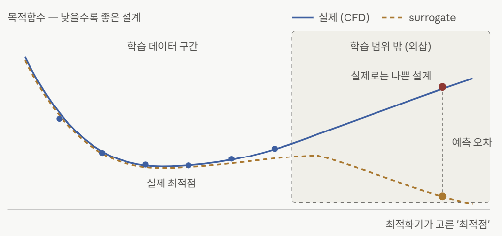

# 발표자료

## 1. 연구 방향성 결정

### 1.1. 연구 주제 및 목표

- **연구 주제:** Agentic AI 기반 OpenFOAM 특정 워크플로우 자율화 구현
- **핵심 목표:**
    - 거대한 범용 시스템(End-to-End Agentic CFD)을 한 번에 구축하기보다, **특정 핵심 워크플로우를 타겟팅**하여 완전 작동하는 자율 피드백 루프 구축
    - GUI 없이 CLI 환경에서 OpenFOAM 제어 및 결과/에러 파싱을 수행하는 파이썬 기반 Agentic Framework 검증

### 1.2. 추진 배경 및 필요성

- **기존 CFD 워크플로우의 Pain Point**
    - 격자 생성, 파라미터 세팅, 발산(Divergence) 시 원인 분석 및 재실행 등 반복적이고 엔지니어의 경험에 의존하는 수동 작업
- **기존 자동화 스크립트의 한계**
    - 예외 상황이나 계산 에러 발생 시 전체 파이프라인이 멈추며, **'에러 원인 추론 및 파라미터 자율 수정(Self-Correction)'이 불가능**
- **Agentic AI 도입의 핵심 가치**
    - LLM/Agent가 텍스트 기반 에러 로그 및 결과 데이터를 파싱하여 파라미터를 자율 재설정하고 재실행하는 **Closed-loop 피드백 체계 구현**

## 2. OPENFOAM 실습



### 개발 환경 구축

- **OS / 가상화:** Windows 11 내 **WSL2 (Ubuntu)** 환경 구축
- **OpenFOAM 설치 및 환경변수 설정:**
    - OpenFOAM 설치 완료 및 `~/.bashrc` 내 환경변수(`$FOAM_TUTORIALS` 등) 바인딩 확인.

---

### ⚙️ 2.2. `cavity` 튜토리얼 케이스 실행 파이프라인

- **대상 케이스:** `incompressible / icoFoam / cavity` (Lid-driven cavity flow)
- **실행 프로세스 (CLI):**

```bash
# 1. 작업 디렉토리 생성 및 튜토리얼 케이스 복사
mkdir -p ~/run && cd ~/run
cp -r $FOAM_TUTORIALS/incompressible/icoFoam/cavity/cavity .
cd cavity

# 2. 격자 생성 (Mesh Generation)
blockMesh

# 3. 비압축성 점성 유동 솔버 실행
icoFoam
```

### 파이썬 기반 OpenFOAM 결과 자동 파싱 및 시각화 스크립트

> LLM Agent가 GUI(ParaView) 없이도 텍스트 기반 결과 파일을 파싱하여 후처리 및 피드백을 수행할 수 있도록 파이프라인 검증.
> 

```python
import os, glob, re
import numpy as np
import matplotlib.pyplot as plt

# 1. 최종 시간 폴더 자동 탐색
times = [f for f in os.listdir('.') if f.replace('.','',1).isdigit() and os.path.isdir(f)]
latest = max(times, key=float)
print(f"Reading Time Step = {latest}")

# 2. U (Velocity) 필드 텍스트 데이터 파싱
with open(f'{latest}/U') as f:
    txt = f.read()

block = txt.split('internalField')[1]
nums = re.findall(r'\(([-0-9.eE+ ]+)\)', block)
vec = np.array([list(map(float, n.split())) for n in nums[:400]])

# 3. 20x20 격자 리셰이프 및 유속 크기 계산
Ux = vec[:, 0].reshape(20, 20)
Uy = vec[:, 1].reshape(20, 20)
mag = np.sqrt(Ux**2 + Uy**2)

# 4. Streamline 시각화 및 이미지 저장
plt.figure(figsize=(6, 5))
plt.imshow(mag, origin='lower', cmap='viridis', extent=[0, 1, 0, 1])
plt.colorbar(label='Velocity Magnitude (m/s)')
plt.streamplot(np.linspace(0, 1, 20), np.linspace(0, 1, 20), Ux, Uy, color='white', density=1.2, linewidth=0.6)
plt.title('Lid-driven Cavity — Velocity Field (Parsed via Python)')
plt.xlabel('X'); plt.ylabel('Y')
plt.savefig('cavity_result.png', dpi=150, bbox_inches='tight')
print("Saved cavity_result.png successfully.")
```

- WSL2 기반 OpenFOAM 환경 세팅, 파일 제어
- GUI 의존성을 제거하고 CLI 실행 → 결과 파일 파싱 → 데이터 시각화의 기초 자동화 동선 확보
- 추후 Agentic AI 프레임워크 구축 시, 이러한 파이썬 파싱 모듈을 Agent의 Evaluation 함수로 활용 가능

## 3. 레퍼런스 논문

### 3.1 핵심 레퍼런스 논문 분석 계획 (CFDAgent)

- **논문 정보: CFDAgent: A language-guided, zero-shot multi-agent system for complex flow simulation**
    - **저자:** Zhaoyue Xu, Long Wang, Hua-Dong Yao, Shizhao Wang, Guowei He et al.
    - **저널 / 출판일:** *Physics of Fluids* (November 2025 / Vol. 37 Issue 11)
    - https://doi.org/10.1063/5.0294696
- **연구 요약:**
    - GPT-4o 및 Multi-agent(전처리·솔버·후처리) 구조와 몰입경계법(Immersed Boundary Solver) 기반 Zero-shot CFD 자동화 프레임워크 제안.
    - 자연어·2D 이미지·3D 형상 멀티모달 입력을 받아 수동 격자 생성 없이 시뮬레이션을 수행하며, 표준 벤치마크 케이스에서 우수한 물리적 타당성 검증.


### 3.2 핵심 레퍼런스 논문 분석 계획 (ChatCFD)

- **논문 정보: ChatCFD: A Large Language Model-Driven Agent for End-to-End Computational Fluid Dynamics Automation with Structured Knowledge and Reasoning**
    - **저자:** E Fan, Kang Hu, Tianhan Zhang et al.
    - **저널 / 출판일:** *Advanced Intelligent Discovery* (June 2026 / Vol. 2 Issue 3)
    - https://advanced.onlinelibrary.wiley.com/doi/10.1002/aidi.202500174
    - https://github.com/ConMoo/ChatCFD
- **연구 요약:**
    - DeepSeek-R1/V3 및 Multi-agent 구조 기반 OpenFOAM end-to-end 자동화 프레임워크 제안.
    - Structured Knowledge Base와 Error Locator 모듈을 활용해 기존 대비 현격히 높은 실행 성공률(82.1%) 및 물리적 타당성(68.12%) 달성.


### 3.3 핵심 레퍼런스 논문 분석 계획 (MF-ASO Agent)

- **논문 정보: AI Agents for Multi-Fidelity Aerodynamic Shape Optimization**
    - **저자:** 양선웅, 강남우 (KAIST)
    - **저널 / 출판일:**  *대한기계학회 학술대회* (2025)
    - https://www.dbpia.co.kr/pdf/pdfView.do?nodeId=NODE12558375
- **연구 요약:**
    - Gemini 1.5 Flash 및 Multi-agent 구조와 MFDNN(Multi-Fidelity Deep Neural Network) 기반 공력 형상 최적화 자동화 프레임워크 제안.
    - 자연어 지시를 해석하여 격자 수렴성 테스트(GCI), Low/High-Fidelity 데이터 생성, 대리 모델 하이퍼 파라미터 자율 튜닝 및 최적화를 조율하여 계산 비용 절감과 높은 최적화 성능 달성.
    
    
    

ChatCFD와 같은 전체 Agentic system을 만들기보단, Agent를 활용한 특정 워크플로우를 제작하는 수준으로 구현부터 시작

<예시>

**격자 수렴성 자동화 Agent (Grid Convergence Workflow)**
• **입력:** 기본 OpenFOAM 케이스
• **Agent 역할:** Coarse / Medium / Fine 격자를 자율 생성해 실행하고, GCI(Grid Convergence Index)를 계산하여 "이 케이스는 Mesh 크기 X일 때 최적"이라는 리포트를 생성

**자율 에러 복구 및 수렴 제어 Agent (Error Recovery Workflow)**
• **입력:** 실행 시 발산(Divergence)이나 에러가 잘 나는 난이도 있는 CFD 케이스
• **Agent 역할:** icofoam 또는 simplefoam 돌리다가 터지면 에러 로그 파싱 → Time step이나 Relaxation factor 낮춰서 재작성 → 수렴할 때까지 재시도.

등등..

---

Meshing agent가 CFD에서 AI agent가 가장 많이 활용되는 분야 중 하나.

validation metric - 몇번을 시도했는지, 몇번을 성공했는지 등등.. → error recovery

스스로 복구하는 부분이 요구됨

격자 수렴성 방향이 더 낫지 않을까

논문까지 가기 위해 필요한 요소

1. 모델, 기존의 다른 베이스라인 모델은 무엇인지
2. 데이터셋 - 기존 논문들이 가장 많이 사용하는 데이터셋 3종류 정도 찾아보기
(ex: input 자연어, output OPENFOAM config 파일)
3. Validation Metric
(ex: 토큰값, 성공률 등등)

실제 산업에서는 어느정도 진행된 상태에서 LLM에게 어떻게 더 개선할지를 물어보거나, 어떤 솔버를 사용하거나 등을 물어볼거임. LLM이 메싱 파일이나 지오메트리를 어떻게 이해할지가 중요할거임.

메쉬 - 양이 엄청 많고, 깊이가 얕음 → LLM이 어려워하는 형식

특정 버전의 OPENFOAM을 사용해야한다는 사소한 문제;

OPENFOAM 버전에 따라 같은 유동을 만들어내기 위한 변환 과정을 LLM으로

쉽지만 시간과 노력많이 필요

데이터셋 - training/test

OPENFOAM 튜토리얼을 dataset으로 사용하는 것에 대한 문제

---

<해야하는 일>

1. 특정 분야에 대한 LLM agent를 사용할 것이면 어떤 분야에 대해서 할 것인지 조사, 후보 제시
2. 범용적인 agent dataset에 대한 어떤 데이터셋이 있는지 조사
3. 한번 돌려보기
4. 깃헙 repository 만들고 공유 - 연구 내용 정리, 발표자료 정리